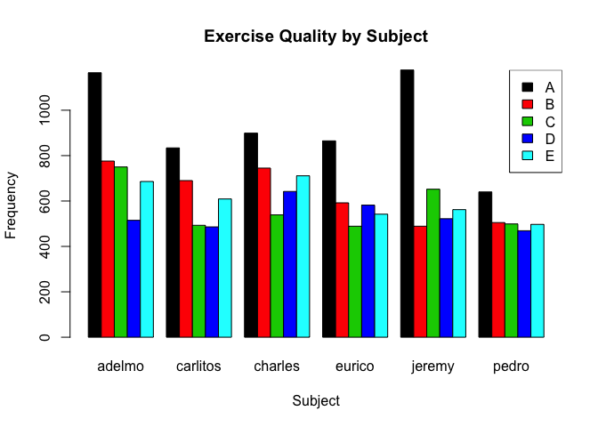
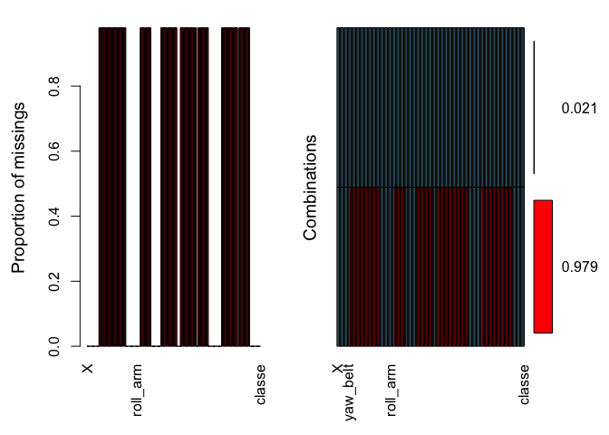
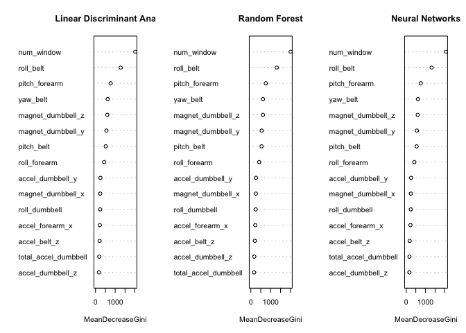
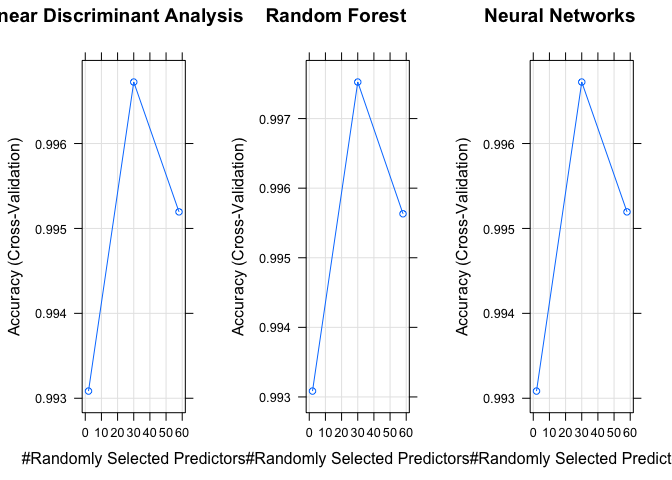
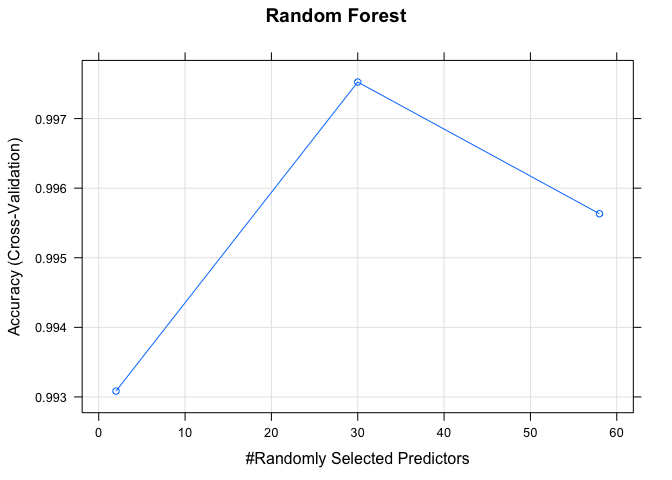
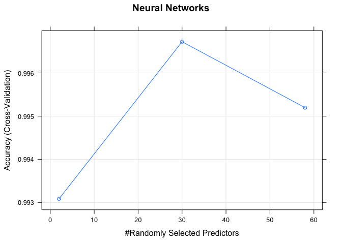

# Human Activity Recognition Tool to Classify the Type of Weight Lifting Exercises
Moh A  
01/04/2017  


# Executive Summary


The aim of this project is to predict the quality of weight lifting exercises through classification of data from from accelerometers on the belt, forearm, arm, and dumbell of 6 participants. The project starts with exploratory data analysis and data cleaning, where 100 out of the 160 variables were neglected as they mostly had missing values. Then, three predictive models (Linear Discriminant Analysis, Random Forest and Neural Networks) were built and an evaluation and comparison of their performance was presented. Though, all three models achieved near perfect accuracy (lowest model achieved 99.83 %) and all of them predicted the 20 cases in the validation data set correctly. However, Random Forest model was selected, because it has a higher tolerance to missing values and irrelevant attributes. In addition, it had great capability dealing with discrete, binary, continuous attributes and handles model parameters better than the other two algorithms.


# Background


Using devices such as Jawbone Up, Nike FuelBand, and Fitbit it is now possible to collect a large amount of data about personal activity relatively inexpensively. These type of devices are part of the quantified self-movement – a group of enthusiasts who take measurements about themselves regularly to improve their health, to find patterns in their behaviour, or because they are tech geeks. One thing that people regularly do is quantify how much of a particular activity they do, but they rarely quantify how well they do it. In this project, **the goal will be to use data from accelerometers on the belt, forearm, arm, and dumbbell of 6 participants to predict the manner in which they did the exercise**. They were asked to perform barbell lifts correctly and incorrectly in 5 different ways. The participants were asked to perform one set of 10 repetitions of the Unilateral Dumbbell Biceps Curl in five different fashions: exactly according to the specification (Class A), while the other 4 classes (B, C, D and E) correspond to common mistakes.

Read more: http://groupware.les.inf.puc-rio.br/har#ixzz4d1GCDX2m


# Exploratory Data Analysis


In the dataset given, there is 19622 observations and 160 variables.

The dependent variable, 'Classe', is a categorical variable corresponding to the five different ways of doing the weight lifting exercise: exactly according to the specification (Class A), throwing the elbows to the front (Class B), lifting the dumbbell only halfway (Class C), lowering the dumbbell only halfway (Class D) and throwing the hips to the front (Class E).

The rest of the variable corresponds to measurements from date, time, belt, arm, forearm and dumbbell sensors.


                           A            B            C            D            E
---------------  -----------  -----------  -----------  -----------  -----------
classe_table      5580.00000   3797.00000   3422.00000   3216.00000   3607.00000
classe_percent      28.43747     19.35073     17.43961     16.38977     18.38243

As seen in the table above, class 'A' (corresponding to correctly performing the exercise) is most frequent class and counts to roughly 28% among the five classes available. 

It is also worth noticing that frequency of class 'A' and hence the quality of performing the exercise varies significantly among the six participant, as evident in the bar plot below.

<!-- -->

The aim of the classification model is to classify if exercise was completed correctly (class A) as well as classifying the type of error made (class: B, C, D and E). Since the task given was to predict the class of 20 unknown observations. A model with an accuracy higher than 95% is needed. For example, the probability of a model with 95% accuracy to predict all cases (20/20) correctly is $p{20} = 0.95^20 = 0.36$. In contrast, a model with 99% accuracy will achieve $0.99^20 = 0.8$ probability in predicting the 20 cases correctly. 


# Data PreProcessing


The raw data file has 19622 observations and 160 variables.

Firstly, looking at the plot below for the proportion of missing data among the dataset variables, it can be noticed that it has many variables with mostly missing and meaningless values (100 out of the 160 variables). Thus, their contribution to the prediction of the 'classe' variable is insignificant and we have to omit these variables.

Secondly, it is wise to remove variables that do not contribute to the prediction of the 'classe' variable. These include non-sensory measurements like: 'X'(row number), time and date related variables.

The rest of the variables have no missing values and are ready for further processing.


# Data Modelling


## Cross Validation & Out of Sample Error Estimation

K-fold cross validation is used to estimate the out of sample error, which is a reasonable balance between prediction accuracy and the computation time. The advantage of this method is that it matters less how the data gets divided. Every data point gets to be in a test set exactly once, and gets to be in a training set k-1 times. The variance of the resulting estimate is reduced as k is increased. The disadvantage of this method is that the training algorithm has to be rerun from scratch k times, which means it takes k times as much computation to make an evaluation. The results are then aggregated to create an overall estimate of the out of sample error. 

## Model 1: Linear Discriminant Analysis 

This model was selected since it is a relatively simple classification algorithm to find a linear combination of features that characterizes or separates two or more classes of objects or events. The resulting combination may be used as a linear classifier. 


## Model 2: Random Forest

The random forest model, being an ensemble learning method for classification, uses multiple learning algorithms to obtain better predictive performance than could be obtained from any of the constituent learning algorithms alone. Random forests have a high predictive accuracy, automatically learns feature interactions and handles lots of irrelevant features well. However, results have a less interpretability than linear discriminant analysis and it has a slow training speed. Same as LDA model, k-fold cross validation with five folds are used.


## Model 3: Neural Networks

Neural Networks is a powerful computational data model that is able to capture and represent complex input/output relationships. A neural network can be thought of as a network of “neurons” organised in layers. The predictors (or inputs) form the bottom layer, and the forecasts (or outputs) form the top layer. There may be intermediate layers containing “hidden neurons”. NNet have a high predictive accuracy, automatically learns feature interactions and handles lots of irrelevant features well. However, results are difficult to interpret and has a slow training speed. Same as LDA model, k-fold cross validation with five folds are used.


# Models Analysis and Evaluation


All three models implemented achieved a very high predictive accuracy, when applied to our test set (30% of the dataset). The highest accuracy was 0.9986 by Random Forest model, whereas Linear Discriminant Analysis and Neural Networks achieved 0.9984 and 0.9983 respectively. Such slight differences in the accuracy score ( difference between highest and lowest accuracy is approx. 0.0003) is very subtle and could be negligible when making a decision of which algorithm to choose.


                                   Linear Discriminant Analysis   Random Forest   Neural Networks 
---------------------------------  -----------------------------  --------------  ----------------
Accuracy                           0.9984707                      0.9983008       0.9983008       
Out_of_Sample_Error                0.001529312                    0.001699235     0.001699235     
Class_A_Sensitivity                1                              1               1               
Prob_Succesful_Prediction          0.9698541                      0.9665583       0.9665583       
All_Cases_Successfully_Predicted   Yes                            Yes             Yes             
Training_Time                      6.819203                       6.613125        6.986297        

As seen in the figure below, all models achieve optimal results with only 30 predictors out 54 predictors resulted after cleaning data. As shown in the figure below for the variable importance plot, the top 8 most important predictors for all three models are:`num_window`, `roll_belt`, `pitch_forearm`, `yaw_belt`, `magnet_drumbell_z`, `magnet_drumbell_y`, `pitch_belt` and `roll_forearm`. 

<!-- -->


                                   Linear Discriminant Analysis   Random Forest   Neural Networks 
---------------------------------  -----------------------------  --------------  ----------------
Accuracy                           0.9984707                      0.9983008       0.9983008       
Out_of_Sample_Error                0.001529312                    0.001699235     0.001699235     
Class_A_Sensitivity                1                              1               1               
Prob_Succesful_Prediction          0.9698541                      0.9665583       0.9665583       
All_Cases_Successfully_Predicted   Yes                            Yes             Yes             
Training_Time                      6.819203                       6.613125        6.986297        

Since the three models achieved a very high prediction accuracy when applied to the held out test set. The Out of Sample Error Rate is expected to be less than 0.2%

Finally, testing all three models on the validation set, all three models successfully classified the 20 cases of the validation set.


# Conclusion


As explained in the previous section, all three models achieved a near perfect accuracy and predicted all the 20 cases in the validation data set. Given that the results presented in the summary table above look to be very close, it appears that a choice between either of the three algorithms is about the same. However, due to the properties of the dataset used in this report. It is sensible to choose Random Forest model over Linear Discriminant Analysis and Neural Networks. This is because it has a higher tolerance to missing values and irrelevant attributes. In addition, it had great capability dealing with discrete, binary, continuous attributes and handles model parameters better than the other two algorithms.


# Reference


- Ugulino, W.; Cardador, D.; Vega, K.; Velloso, E.; Milidiu, R.; Fuks, H. Wearable Computing: Accelerometers' Data Classification of Body Postures and Movements. Proceedings of 21st Brazilian Symposium on Artificial Intelligence. Advances in Artificial Intelligence - SBIA 2012. In: Lecture Notes in Computer Science. , pp. 52-61. Curitiba, PR: Springer Berlin / Heidelberg, 2012. ISBN 978-3-642-34458-9. DOI: 10.1007/978-3-642-34459-6_6.


# Appendix


```r
library(caret)
library(ggplot2)
library(knitr)
library(VIM)
library(grid)
library(gridExtra)
library(randomForest)
load("~/Human-Activity-Recognition-Tool-to-Classify-the-Type-of-Weight-Lifting-Exercises/workspace_for_testing.RData")
```


```r
dataset_url <- "https://d396qusza40orc.cloudfront.net/predmachlearn/pml-training.csv"
validation_url <- "https://d396qusza40orc.cloudfront.net/predmachlearn/pml-testing.csv"
dataset_filename <- "./data/pml-training.csv"
validation_filename <- "./data/pml-testing.csv"

if (!file.exists("./data")){
    dir.create("./data")
}
if(!file.exists(dataset_filename)){
    download.file(dataset_url, destfile = dataset_filename, method = "curl")
}

if(!file.exists(validation_filename)){
    download.file(validation_url, destfile = validation_filename, method = "curl")
}

raw_data <- read.table("./data/pml-training.csv", header = TRUE, sep = ",",  na.strings = c(NA, ""))

validation_set <- read.table("./data/pml-testing.csv", header = TRUE, sep = ",",  na.strings = c(NA, ""))
```


```r
classe_table <- table(raw_data$classe)
classe_percent <- (100*classe_table)/length(raw_data$classe)
kable(rbind(classe_table, classe_percent))
```

                           A            B            C            D            E
---------------  -----------  -----------  -----------  -----------  -----------
classe_table      5580.00000   3797.00000   3422.00000   3216.00000   3607.00000
classe_percent      28.43747     19.35073     17.43961     16.38977     18.38243


```r
name_per_classe <-table(raw_data$classe, raw_data$user_name)

barplot(name_per_classe,
xlab = "Subject",
ylab = "Frequency",
main="Exercise Quality by Subject",
col = as.factor(rownames(name_per_classe)),
beside=TRUE
)

legend("topright" ,legend= rownames(name_per_classe), fill  = as.factor(rownames(name_per_classe)))
```

<!-- -->


```r
aggr(raw_data, prop=T, numbers=T)
```

<!-- -->

```r
mojority_NA_columns <- which(sapply(raw_data, function(x) sum(is.na(x)) >(nrow(raw_data)*0.9)))
cleaned_data <- raw_data[, -mojority_NA_columns]
cleaned_data <- cleaned_data[, -c(1,3,4,5,6)]
```


```r
set.seed(55555)
inTrain <- createDataPartition(y=cleaned_data$classe,
p=0.7, list=FALSE)
training <- cleaned_data[inTrain,]
testing <- cleaned_data[-inTrain,]
```


```r
library(parallel)
library(doParallel)
library(mlbench)
library(iterators)
library(foreach)

cluster <- makeCluster(detectCores())
registerDoParallel(cluster)
```


```r
models_name <- c("Linear Discriminant Analysis", "Random Forest", "Neural Networks")
models_accuracy <- c(lda_conf_mat$overall[1], rf_conf_mat$overall[1], nnet_conf_mat$overall[1])
OOSE <- 1- models_accuracy
models_sensitivity_A <- c(lda_conf_mat$byClass[1,1],rf_conf_mat$byClass[1,1], nnet_conf_mat$byClass[1,1])
correct_pred_prob <- models_accuracy^20
models_time <- c(lda_time, rf_time, nnet_time)
successful_pred <- c("Yes", "Yes", "Yes")

parameters_name <- c("","Accuracy", "Out of Sample Error", "Class A Sensitivity", "20 Succesful Prediction Prob.", "Cases Successfully Predicted", "Training Time")

tb1 <- rbind(models_name, models_accuracy, OOSE, models_sensitivity_A, correct_pred_prob, successful_pred, models_time)

tbl5 <- data.frame(Model = models_name,Accuracy = models_accuracy, Out_of_Sample_Error= OOSE, Class_A_Sensitivity = models_sensitivity_A, Prob_Succesful_Prediction = correct_pred_prob, All_Cases_Successfully_Predicted = successful_pred, Training_Time = models_time)

hy <- t(tbl5)
colnames(hy) <- hy[1,]
kable(hy[-1,])
```

                                   Linear Discriminant Analysis   Random Forest   Neural Networks 
---------------------------------  -----------------------------  --------------  ----------------
Accuracy                           0.9984707                      0.9983008       0.9983008       
Out_of_Sample_Error                0.001529312                    0.001699235     0.001699235     
Class_A_Sensitivity                1                              1               1               
Prob_Succesful_Prediction          0.9698541                      0.9665583       0.9665583       
All_Cases_Successfully_Predicted   Yes                            Yes             Yes             
Training_Time                      6.819203                       6.613125        6.986297        


```r
library(ggplot2)
library(grid)
library(gridExtra)

par(mfrow=c(1,3))

varImpPlot(lda_model$finalModel,
           main="Linear Discriminant Analysis",
           n.var = 15,
           type=2)

varImpPlot(rf_model$finalModel,
           main="Random Forest",
           n.var = 15,
           type=2)
varImpPlot(nnet_model$finalModel,
           main="Neural Networks",
           n.var = 15,
           type=2)
```

<!-- -->


```r
par(mfrow = c(1,3))

plot(lda_model,
     main="Linear Discriminant Analysis")
```

<!-- -->

```r
plot(rf_model,
     main="Random Forest")
```

<!-- -->

```r
plot(lda_model,
     main="Neural Networks")
```

<!-- -->


```r
actual_answers <- c("B" ,"A","B","A", "A","E", "D", "B", "A", "A","B", "C", "B", "A", "E", "E", "A", "B", "B", "B")

lda_predicted_validation <- predict(lda_model,validation_set)
lda_validation_results <- data.frame(actual_answers,lda_predicted_validation)
identical(as.character(lda_validation_results$actual_answers) , as.character(lda_validation_results$lda_predicted_validation))
```

```
## [1] TRUE
```

```r
rf_predicted_validation <- predict(rf_model,validation_set)
rf_validation_results <- data.frame(actual_answers,rf_predicted_validation)
identical(as.character(rf_validation_results$actual_answers) , as.character(rf_validation_results$rf_predicted_validation))
```

```
## [1] TRUE
```

```r
nnet_predicted_validation <- predict(nnet_model,validation_set)
nnet_validation_results <- data.frame(actual_answers,nnet_predicted_validation)
identical(as.character(nnet_validation_results$actual_answers) , as.character(nnet_validation_results$nnet_predicted_validation))
```

```
## [1] TRUE
```

```r
pml_write_files = function(x){
  n = length(x)
  for(i in 1:n){
    filename = paste("./data/problem_id_",i,".txt")
    write.table(x[i],file=filename,quote=FALSE,row.names=FALSE,col.names=FALSE)
  }
}
predicted_chars <- as.character(lda_predicted_validation)
pml_write_files(predicted_chars)
```


